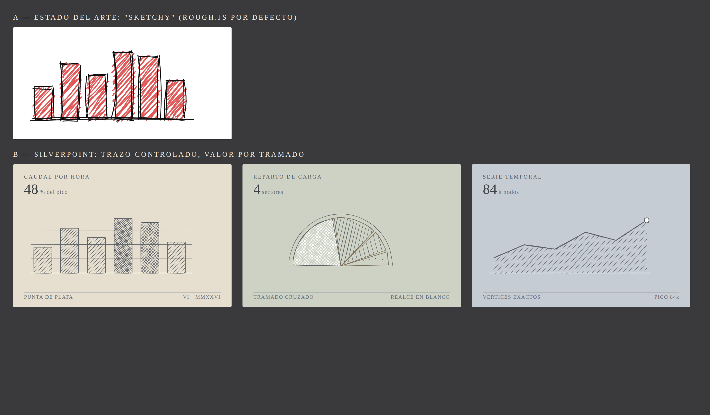

# silverpoint

Charts for React, Vue and Angular whose visual language is historical drawing technique.

The first style reproduces the mechanics of Renaissance **silverpoint**: a prepared
middle-tone substrate, a fine silver line, tonal value built from hatch density, and white
heightening reserved for the live value. The engine supports several *grounds*; the
Renaissance one is the first.

Unlike every other hand-drawn charting library, the irregularity here lives only in the
ornament: the geometry of the data is exact, and every chart offers a `precision` mode with
inking switched off entirely.

> In specification. See [`specs/`](specs/) — eight Spec-Driven Design artifacts, from the
> constitution through to the Analyze gate.

MIT. Typeface: EB Garamond, SIL Open Font License.